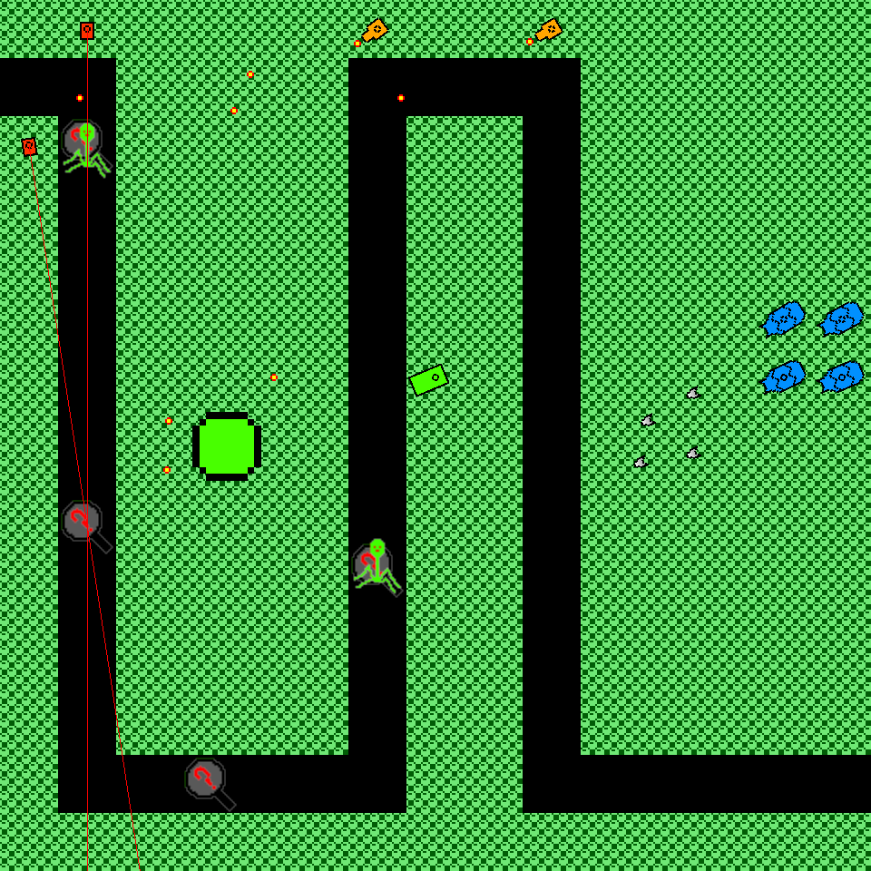

# Inside AV
A tower defence game created for an open-ended Java assignment during second year of my software development course.

A working cross-platform build of the game is available <a href="https://github.com/Ronan-H/Inside-AV/raw/master/builds/Inside-AV.jar">here</a>. This should run after double clicking, with Java installed.

See how it was developed at https://simplejavagamedev.wordpress.com/.
